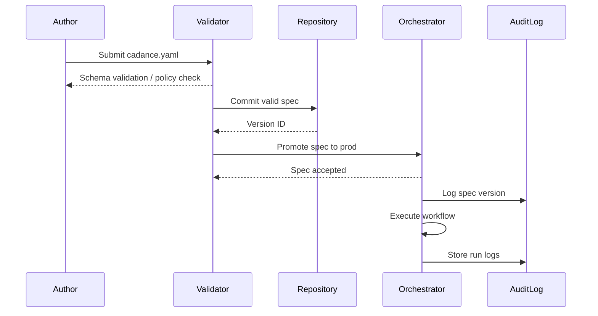

## 3.1 Overview

The CADANCE™ spec is a declarative, version-controlled contract that defines the entire lifecycle of an AI-driven workflow. It codifies what you want done, who does it, with which data, under which policies and how the work is run. By encoding these elements in a `cadance.yaml` or `cadance.json` file, CADANCE™ transforms prompt-based experimentation into infrastructure-as-configuration. Workflows become reproducible across environments, diffable in code reviews and auditable after deployment.

## 3.2 Design Rationale

Traditional AI systems rely on hidden prompts and ad-hoc scripts. This leads to three chronic problems:

- **Brittleness:** Prompts are brittle; they break when the underlying model changes or when the context is insufficient. CADANCE™ decouples behavior from prompts by capturing plans, roles, templates and controls as structured data.
- **Lack of Auditability:** Without a single source of truth, it is impossible to explain why a system made a decision. CADANCE™ provides that source and logs the spec alongside each run.
- **Lack of Reproducibility:** A prompt may produce different results depending on temperature, order of messages or hidden state. CADANCE™ enforces deterministic seeds, budgets and step ordering so workflows can be replayed with identical outcomes.

## 3.3 Components of the CADANCE™ Spec

CADANCE™ stands for Config, Agents, Data, Analysis, Norms, Controls and Execution. Each section of the spec encodes a different aspect of the workflow:

- **Config:** Defines high-level objectives, success criteria and budgets (cost/latency/SLOs).
- **Agents:** Lists roles, capabilities, constraints and escalation paths.
- **Data:** Specifies knowledge sources, memory scopes, data contracts and citation requirements.
- **Analysis:** Defines templates, output schemas and evaluation rubrics.
- **Norms:** Encodes policies, governance rules, approval requirements and HITL checkpoints.
- **Controls:** Defines execution graph, retries, timeouts, gating conditions and deterministic seeds.
- **Execution:** Specifies runbooks, handoffs, logging levels, retention policies and audit requirements.

## 3.4 CADANCE™ Lifecycle

The CADANCE™ spec moves through distinct stages:

1.  **Author:** Human defines or edits the spec file.
2.  **Validate:** Static validation checks the schema, budgets and policy compliance.
3.  **Version:** Specs are committed to version control (Git).
4.  **Promote:** Validated specs are promoted to staging and production environments.
5.  **Run:** The orchestrator reads the spec, constructs flows and executes tasks.
6.  **Audit:** After execution, logs, prompts, citations and outputs are stored for audit and evaluation.

## 3.5 Failure Modes & Mitigations

- **Invalid Spec:** Schema or policy violations cause validation errors. Mitigation: provide clear error messages and an IDE plugin for linting.
- **Budget Exceeded:** If cost or latency budgets are exceeded, flows are terminated. Mitigation: pre-execution budget estimation and mid-flight alerts.
- **Policy Violation:** If a step attempts an action that violates norms, the system triggers a human-in-the-loop (HITL) checkpoint. Mitigation: fine-grained RBAC and runtime gating.

## 3.6 Metrics & SLOs

- **Spec Validation Time:** < [METRIC_PLACEHOLDER] ms.
- **Spec Promotion Time:** < [METRIC_PLACEHOLDER] s.
- **Spec Version Adoption Rate:** Fraction of runs using latest spec version within a time window.

## 3.7 Key Takeaways

- The CADANCE™ spec provides a single source of truth for workflow behavior.
- It decomposes AI configuration into seven coherent sections.
- Specs are versioned, validated and promoted through a lifecycle akin to infrastructure-as-code.