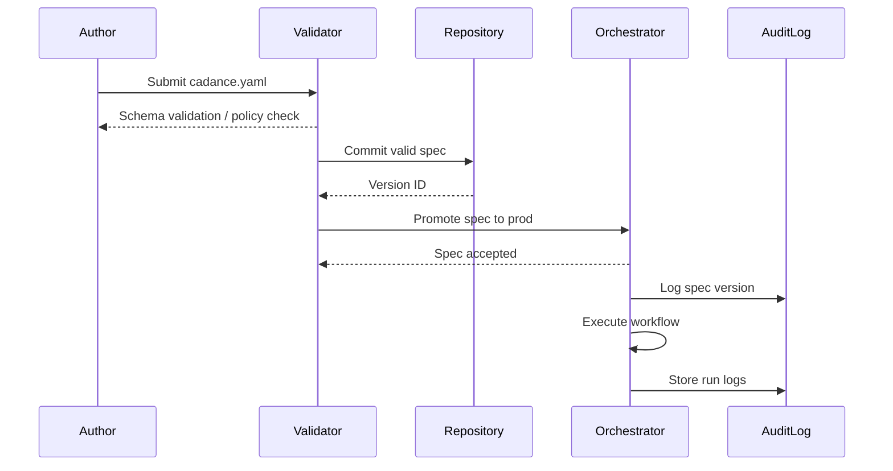

The CADANCE™ spec is a declarative, version-controlled contract that defines the entire lifecycle of an AI-driven workflow. It is a human-readable, machine-executable contract that ensures every action taken by the system is traceable, reproducible, and aligned with your explicit intent.

## The 7 Components of the CADANCE™ Spec

CADANCE™ is an acronym for the seven core components of the specification:

-   **Config:** Defines the high-level objectives, success criteria, and operational budgets.
-   **Agents:** Specifies the roles, capabilities, constraints, and escalation paths for the specialist agents.
-   **Data:** Declares the knowledge sources, memory scopes, data contracts, and citation requirements.
-   **Analysis:** Defines the output templates, evaluation rubrics, and schemas that the agents must adhere to.
-   **Norms:** Specifies the policies, governance rules, approval requirements, and human-in-the-loop (HITL) checkpoints.
-   **Controls:** Defines the state graphs, retry/timeout logic, gating conditions, and deterministic seeds.
-   **Execution:** Specifies the runbooks, handoffs, logging levels, artifact retention policies, and audit requirements.

## The CADANCE™ Lifecycle

The CADANCE™ spec moves through distinct stages:

1.  **Author:** Human defines or edits the spec file.
2.  **Validate:** Static validation checks the schema, budgets, and policy compliance.
3.  **Version:** Specs are committed to version control (Git).
4.  **Promote:** Validated specs are promoted to staging and production environments.
5.  **Run:** The orchestrator reads the spec, constructs flows, and executes tasks.
6.  **Audit:** After execution, logs, prompts, citations, and outputs are stored for audit and evaluation.
