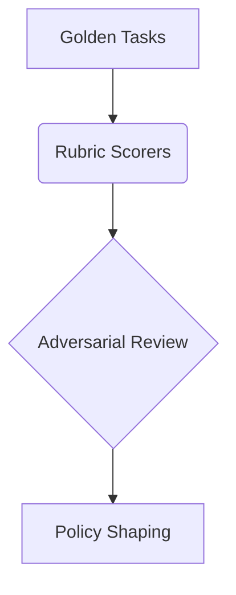

Trust is paramount in an enterprise AI system. The MindLab platform includes a robust Evaluation Loop, a continuous process designed to ensure that the outputs of our specialist agents are not only accurate, but also consistently aligned with your business objectives and quality standards.

## A Multi-Faceted Approach

The Evaluation Loop is a multi-faceted system that includes both automated and human-in-the-loop processes.

-   **Goldens & Rubrics:** We establish a set of "golden tasks," which are representative examples of the workflows you will be running on the platform.
-   **Adversarial Review:** We employ adversarial review, where a separate set of agents is tasked with finding flaws and edge cases in the outputs of the primary agents.
-   **Policy Shaping:** The data generated by this evaluation process is fed back into the Orchestrator as a set of reward-style signals.

## A Commitment to Quality

The Evaluation Loop is a key part of our commitment to quality. By continuously measuring and refining the performance of our platform, we can ensure that we are always delivering the best possible results for our customers.