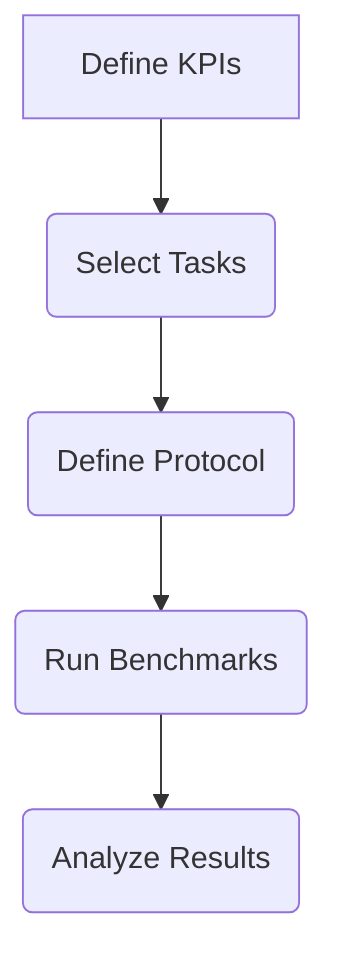

## Overview

We are committed to a rigorous, data-driven approach to measuring the performance of the MindLab platform. Our benchmarking methodology is designed to be transparent, reproducible, and aligned with the real-world business outcomes that matter to our customers.

## Design Rationale

The goal of our benchmarking methodology is to provide a fair and accurate assessment of our platform's performance. We have designed our methodology to be:

-   **Transparent:** We will make our methodology and our results publicly available.
-   **Reproducible:** We will provide all the necessary data to reproduce our results.
-   **Aligned with Business Outcomes:** We will focus on the metrics that matter most to our customers.

## Mechanism/Algorithm

Our benchmarking methodology is a multi-step process.

### Key Performance Indicators (KPIs)

We track a wide range of KPIs to measure the performance of our platform.

<CardGroup cols={3}>
  <Card title="Unit Cost per Solved Task" icon="dollar-sign">
    The total cost of solving a task, including all model and infrastructure costs.
  </Card>
  <Card title="Success Score" icon="check-circle">
    A measure of the quality of the final output, as determined by our Evaluation Loop.
  </Card>
  <Card title="Variance Under Budget" icon="chart-line">
    A measure of our ability to consistently deliver results within the cost and latency budgets defined in the CADANCE™ Spec.
  </Card>
  <Card title="Time-to-Value (TTV)" icon="clock">
    The time it takes to go from a new idea to a fully deployed and operational workflow.
  </Card>
  <Card title="Regression Pass Rate" icon="shield-check">
    The percentage of our "golden tasks" that pass our continuous regression testing.
  </Card>
</CardGroup>

### Tasks

We benchmark our platform against a wide range of tasks that are representative of the real-world workflows of our customers.

<AccordionGroup>
  <Accordion title="Education">
    -   **Assessment Loop:** Generating, grading, and providing feedback on student assessments.
  </Accordion>
  <Accordion title="HR">
    -   **Candidate Screens:** Screening resumes and conducting initial interviews with candidates.
  </Accordion>
  <Accordion title="Legal">
    -   **Clause Review:** Reviewing legal documents for specific clauses and potential risks.
  </Accordion>
  <Accordion title="Research">
    -   **Lit Synthesis:** Synthesizing information from a large corpus of research papers.
  </Accordion>
</AccordionGroup>

### Protocol

Our benchmarking protocol is designed to be as transparent and reproducible as possible.

<Steps>
  <Step title="Fixed CADANCE™ Specs">
    All of our benchmarks are run against a fixed set of CADANCE™ Specs.
  </Step>
  <Step title="Seed Control">
    We use deterministic seeds to ensure that our benchmarks are reproducible.
  </Step>
  <Step title="Reproducible Datasets">
    We use a set of publicly available datasets for our benchmarks.
  </Step>
  <Step title="Trace Bundles">
    We will make the full trace bundles for our benchmark runs available upon request.
  </Step>
</Steps>

## Data/Interfaces

We will make all of the data necessary to reproduce our benchmark results available to our customers and partners.

## Failure Modes & Mitigations

-   **Benchmark Overfitting:** We will use a variety of techniques to prevent our platform from overfitting to our benchmark tasks.
-   **Data Leakage:** We will use a separate, held-out test set for our final evaluations to prevent data leakage.

## Example Walkthrough

A user wants to benchmark the performance of our platform on a legal clause review task. They would be provided with the relevant CADANCE™ Spec, dataset, and trace bundle. They would then be able to run the benchmark and to compare their results to our published results.

## Metrics & SLOs

-   **Benchmark Reproducibility:** > [METRIC_PLACEHOLDER]%
-   **Benchmark Accuracy:** > [METRIC_PLACEHOLDER]%

## Key Takeaways

-   We are committed to a rigorous, data-driven approach to measuring the performance of our platform.
-   Our benchmarking methodology is designed to be transparent, reproducible, and aligned with the real-world business outcomes that matter to our customers.
-   We will make all of the data necessary to reproduce our benchmark results available to our customers and partners.