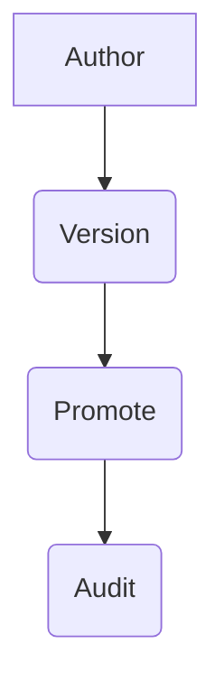

## Overview

The core philosophy of the MindLab platform is **"Configuration-first."** We believe that for AI to be a trusted, enterprise-grade asset, its behavior must be deterministic, repeatable, and auditable. This cannot be achieved through prompting alone.

This is why we created the CADANCE™ Spec, a single, versioned specification that declaratively defines the entire lifecycle of an AI-driven workflow. It is a human-readable, machine-executable contract that ensures every action taken by the system is traceable, reproducible, and aligned with your explicit intent.

The spec ships as a `cadance.yaml` or `cadance.json` file, allowing you to manage your AI's behavior with the same rigor as your infrastructure-as-code.

## Design Rationale

The CADANCE™ Spec is designed to solve three key problems with traditional AI development:

1.  **Brittleness:** AI systems that are built on a foundation of prompts are brittle and prone to breaking when the underlying models are updated.
2.  **Lack of Auditability:** It is difficult to audit the behavior of a prompt-based system, as there is no single source of truth for why a particular decision was made.
3.  **Lack of Reproducibility:** It is difficult to reproduce the behavior of a prompt-based system, as the same prompt can produce different results depending on the state of the model.

The CADANCE™ Spec solves these problems by providing a declarative, versioned, and auditable format for defining the behavior of your AI systems.

## Mechanism/Algorithm

The CADANCE™ Spec is a hierarchical data structure that is composed of seven core components.



### The 7 Components of the CADANCE™ Spec

CADANCE is an acronym for the seven core components of the specification:

<AccordionGroup>
  <Accordion title="Config">
    Defines the high-level objectives, success criteria, and operational budgets (cost, latency, SLOs) for the workflow.
  </Accordion>
  <Accordion title="Agents">
    Specifies the roles, capabilities, constraints, and escalation paths for the specialist agents involved in the workflow.
  </Accordion>
  <Accordion title="Data">
    Declares the knowledge sources, memory scopes, data contracts, and citation requirements for the workflow.
  </Accordion>
  <Accordion title="Analysis">
    Defines the output templates, evaluation rubrics, and schemas that the agents must adhere to.
  </Accordion>
  <Accordion title="Norms">
    Specifies the policies, governance rules, approval requirements, and human-in-the-loop (HITL) checkpoints for the workflow.
  </Accordion>
  <Accordion title="Controls">
    Defines the state graphs, retry/timeout logic, gating conditions, and deterministic seeds for the workflow's execution.
  </Accordion>
  <Accordion title="Execution">
    Specifies the runbooks, handoffs, logging levels, artifact retention policies, and audit requirements for the workflow.
  </Accordion>
</AccordionGroup>

## Data/Interfaces

The CADANCE™ Spec is a human-readable, machine-executable contract that is defined in a `cadance.yaml` or `cadance.json` file.

### Schema Excerpt

```yaml
Config:
  objective: string
  success_criteria: string
  budget:
    cost: float
    latency: string
```

## Failure Modes & Mitigations

-   **Invalid Spec:** The platform will reject any spec that does not conform to the CADANCE™ schema.
-   **Policy Violation:** The platform will reject any spec that violates a global policy.
-   **Budget Exceeded:** The platform will terminate any workflow that exceeds its budget.

## Example Walkthrough

Here is a minimal yet realistic `cadance.yaml` for a simple workflow:

```yaml
Config:
  objective: "Analyze a financial news article for key points and sentiment."
  success_criteria: "A concise summary and a sentiment score (positive, negative, neutral)."
  budget:
    cost: 1.00
    latency: 60s
```

## Metrics & SLOs

-   **Spec Validation Time:** < [METRIC_PLACEHOLDER] ms
-   **Spec Deployment Time:** < [METRIC_PLACEHOLDER] s

## Key Takeaways

-   The CADANCE™ Spec is the declarative heart of the MindLab platform.
-   It is designed to solve the problems of brittleness, lack of auditability, and lack of reproducibility that are inherent in prompt-based AI systems.
-   It is a human-readable, machine-executable contract that is defined in a `cadance.yaml` or `cadance.json` file.
-   It is composed of seven core components: Config, Agents, Data, Analysis, Norms, Controls, and Execution.
-   It is the key to building AI systems that are deterministic, repeatable, and auditable.