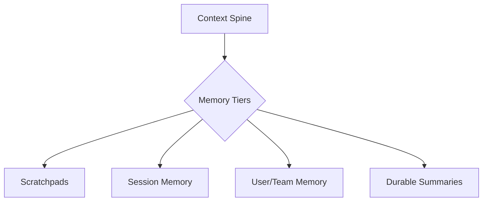

## Overview

MindLab is a stateful system by design. Unlike stateless tools that suffer from corporate amnesia, our platform is built on the Context Spine, a sophisticated architecture for managing knowledge and memory across your entire organization.

## Design Rationale

The Context Spine is designed to solve three key problems with traditional AI systems:

1.  **Lack of Context:** Stateless AI tools have no memory of past interactions, which makes them difficult to use for complex, multi-turn workflows.
2.  **Lack of Auditability:** It is difficult to audit the behavior of a stateless AI system, as there is no single source of truth for why a particular decision was made.
3.  **Lack of Personalization:** Stateless AI systems are unable to learn from user feedback, which makes it difficult to provide a personalized experience.

The Context Spine solves these problems by providing a stateful, auditable, and personalized architecture for managing knowledge and memory.

## Mechanism/Algorithm

The Context Spine is a tiered system that is designed to provide the right level of context at the right time.

### Evidence-First Retrieval

The foundation of the Context Spine is an "evidence-first" approach. Before an agent acts, it performs a planning-aware query against the available knowledge sources. This ensures that all actions are grounded in verifiable data, and all outputs are accompanied by source-linked citations. This is a critical capability for auditable, enterprise-grade AI.

### Memory Tiers

The Context Spine is not a monolithic database; it is a tiered system designed to provide the right level of context at the right time.

<AccordionGroup>
  <Accordion title="Scratchpads">
    Ephemeral, short-term memory used by an agent during the execution of a single task. This is where the agent "thinks," breaking down problems and formulating plans.
  </Accordion>
  <Accordion title="Session Memory">
    Context that persists for the duration of a single user session. This allows an agent to remember the immediate history of the conversation and provide a more natural, interactive experience.
  </Accordion>
  <Accordion title="User/Team Memory">
    Durable memory that is scoped to a specific user or team. This is where the system stores preferences, project details, and other long-term contextual information.
  </Accordion>
  <Accordion title="Durable Summaries">
    Periodically, the system synthesizes the most important information from the other memory tiers into durable summaries. These summaries are governed by strict retention policies and form the long-term, compounding knowledge asset of the organization.
  </Accordion>
</AccordionGroup>

### Cross-Turn Coherence

The Context Spine also includes a mechanism for ensuring cross-turn coherence. A `Reviewer` agent can enforce consistency and rollback the state of the system if it detects weak or contradictory evidence.

## Data/Interfaces

The Context Spine exposes a simple, queryable interface to the Orchestrator. The Orchestrator can query the Context Spine for information about a particular user, team, or project, and the Context Spine will return the relevant information.

## Failure Modes & Mitigations

-   **Data Staleness:** The data in the Context Spine may become stale. We mitigate this risk by providing a mechanism for users to manually refresh the data.
-   **Data Privacy:** The Context Spine may contain sensitive data. We mitigate this risk by providing a comprehensive set of privacy controls.

## Example Walkthrough

A user asks the Orchestrator to create a competitive analysis report. The Orchestrator queries the Context Spine for information about the user's team and project. The Context Spine returns the relevant information, and the Orchestrator uses this information to create a personalized report.

## Metrics & SLOs

-   **Query Time:** < [METRIC_PLACEHOLDER] ms
-   **Data Freshness:** > [METRIC_PLACEHOLDER]%

## Key Takeaways

-   The Context Spine is a stateful architecture for managing knowledge and memory.
-   It is designed to solve the problems of lack of context, lack of auditability, and lack of personalization that are inherent in traditional AI systems.
-   It is a tiered system that is designed to provide the right level of context at the right time.
-   It includes a mechanism for ensuring cross-turn coherence.