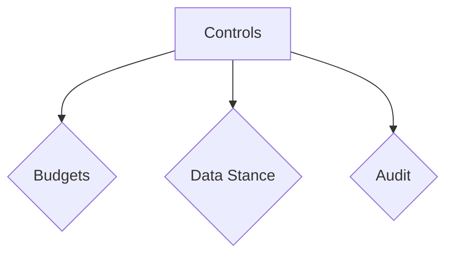

## Overview

The MindLab platform is designed for the rigors of a production enterprise environment. We provide a suite of robust controls that ensure every AI-driven workflow is executed with safety, stability, and complete auditability.

## Design Rationale

The Controls, Security & Governance features of the MindLab platform are designed to solve three key problems with traditional AI systems:

1.  **Lack of Control:** It is difficult to control the behavior of a black-box AI system.
2.  **Lack of Security:** It is difficult to secure the data that is used to train and operate an AI system.
3.  **Lack of Governance:** It is difficult to govern the use of an AI system in a way that is aligned with your organizational policies.

The MindLab platform solves these problems by providing a comprehensive set of controls, security features, and governance tools.

## Mechanism/Algorithm

The Controls, Security & Governance features of the MindLab platform are implemented as a set of modular components that can be configured to meet the specific needs of your organization.

### Budgets

Define granular budgets for cost and latency at the per-plan, per-role, or even per-step level. This ensures that your AI operations always stay within your predefined operational envelopes.

### Data Stance

<CardGroup cols={2}>
  <Card title="Data Ownership" icon="file-shield">
    Your organization retains full ownership of all your data.
  </Card>
  <Card title="Data Residency & Isolation" icon="server">
    We provide flexible data residency and isolation options to meet your specific compliance needs.
  </Card>
  <Card title="No FM Training on Private Data" icon="user-x">
    We will never use your private data to train foundational models.
  </Card>
</CardGroup>

### Audit

<AccordionGroup>
  <Accordion title="Tamper-Evident Logs">
    Every action taken by the system is recorded in a tamper-evident log. Every route, prompt, citation, and vote is cryptographically signed and traceable, providing a complete and immutable audit trail for compliance and security.
  </Accordion>
  <Accordion title="HITL Checkpoints">
    For mission-critical tasks, you can insert human-in-the-loop (HITL) checkpoints to ensure that a human reviews and approves the work of an agent before it proceeds.
  </Accordion>
</AccordionGroup>

## Data/Interfaces

The Controls, Security & Governance features of the MindLab platform are exposed through a simple, web-based interface.

## Failure Modes & Mitigations

-   **Budget Exceeded:** The platform will terminate any workflow that exceeds its budget.
-   **Policy Violation:** The platform will reject any spec that violates a global policy.

## Example Walkthrough

A user wants to create a competitive analysis report. The Orchestrator creates a workflow and submits it to the Flow Engine. The Flow Engine checks to see if the workflow complies with all of the relevant policies. If it does, the workflow is executed. If it does not, the workflow is rejected.

## Metrics & SLOs

-   **Policy Enforcement Time:** < [METRIC_PLACEHOLDER] ms
-   **Audit Log Availability:** > [METRIC_PLACEHOLDER]%

## Key Takeaways

-   The MindLab platform provides a comprehensive set of controls, security features, and governance tools.
-   These features are designed to solve the problems of lack of control, lack of security, and lack of governance that are inherent in traditional AI systems.
-   These features are implemented as a set of modular components that can be configured to meet the specific needs of your organization.