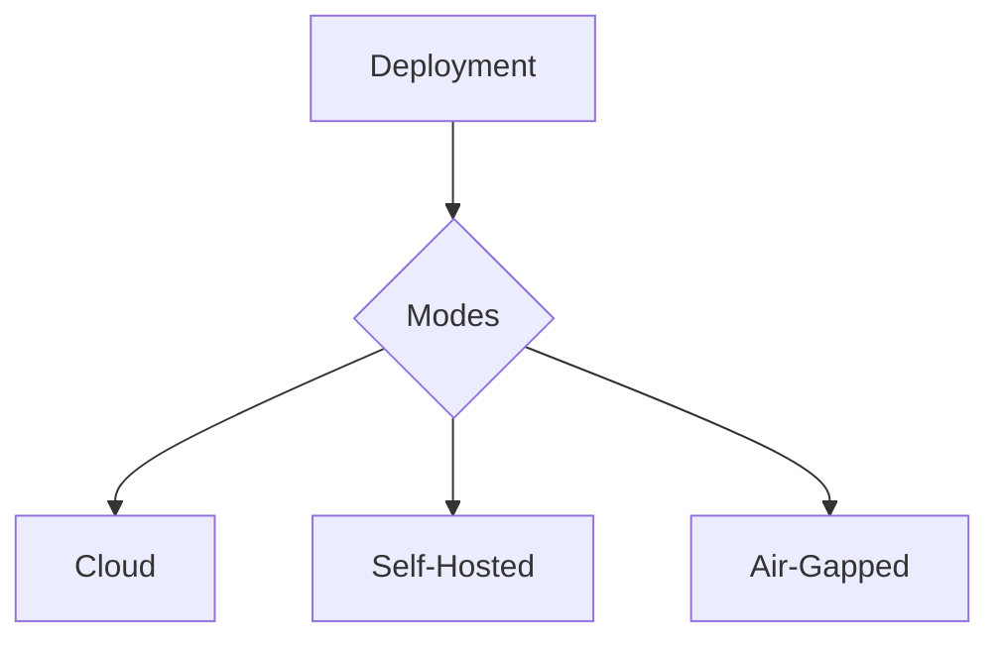

## Overview

The MindLab platform is designed to be deployed and operated in a variety of environments, from the cloud to air-gapped on-premise.

## Design Rationale

The Deployment & Operations features of the MindLab platform are designed to solve three key problems with traditional AI systems:

1.  **Lack of Flexibility:** It is difficult to deploy and operate a monolithic AI system in a variety of environments.
2.  **Lack of Scalability:** It is difficult to scale a monolithic AI system to meet the needs of the largest and most demanding enterprises.
3.  **Lack of Visibility:** It is difficult to get deep visibility into the health and performance of a black-box AI system.

The MindLab platform solves these problems by providing a flexible, scalable, and transparent architecture for deploying and operating your AI systems.

## Mechanism/Algorithm

The Deployment & Operations features of the MindLab platform are implemented as a set of modular components that can be configured to meet the specific needs of your organization.

### Deployment Modes

<CardGroup cols={3}>
  <Card title="Cloud" icon="cloud">
    Our fully managed cloud offering is the easiest way to get started with MindLab.
  </Card>
  <Card title="Self-Hosted" icon="server">
    For customers with specific data residency or security requirements, we offer a self-hosted option.
  </Card>
  <Card title="Air-Gapped" icon="shield-off">
    For customers with the most stringent security requirements, we offer an air-gapped deployment option.
  </Card>
</CardGroup>

### Scaling

The MindLab platform is designed to scale to meet the needs of the largest and most demanding enterprises.

<AccordionGroup>
  <Accordion title="Worker Pools">
    Our platform is built on a distributed architecture of worker pools that can be scaled horizontally to meet any level of demand.
  </Accordion>
  <Accordion title="Backpressure">
    The platform includes a sophisticated backpressure system that ensures that the system remains stable and responsive even under heavy load.
  </Accordion>
  <Accordion title="Caching">
    We use a multi-layered caching strategy to ensure that the most frequently accessed data is always available at the lowest possible latency.
  </Accordion>
  <Accordion title="Budget Enforcement">
    Our platform includes a robust budget enforcement system that ensures that your AI operations always stay within your predefined operational envelopes.
  </Accordion>
</AccordionGroup>

### SRE Hooks

The MindLab platform includes a comprehensive set of SRE hooks that provide deep visibility into the health and performance of the system.

<CardGroup cols={3}>
  <Card title="Metrics" icon="chart-line">
    We provide a rich set of metrics that can be integrated with your existing monitoring and alerting systems.
  </Card>
  <Card title="Traces" icon="route">
    We provide detailed traces for every request, allowing you to quickly identify and resolve performance bottlenecks.
  </Card>
  <Card title="Alerts" icon="siren">
    We provide a pre-configured set of alerts that will notify you of any potential issues with the platform.
  </Card>
</CardGroup>

## Data/Interfaces

The Deployment & Operations features of the MindLab platform are exposed through a simple, web-based interface.

## Failure Modes & Mitigations

-   **Deployment Failure:** A deployment may fail due to an error in the environment. In this case, the platform will automatically roll back to the previous known-good state.
-   **Scaling Failure:** The platform may be unable to scale to meet a sudden spike in demand. In this case, the platform will gracefully degrade performance.

## Example Walkthrough

A user wants to deploy the MindLab platform in an air-gapped environment. They would use our self-hosted deployment option and would follow our detailed documentation to install and configure the platform.

## Metrics & SLOs

-   **Deployment Time:** < [METRIC_PLACEHOLDER] hours
-   **Uptime:** > [METRIC_PLACEHOLDER]%

## Key Takeaways

-   The MindLab platform is designed to be deployed and operated in a variety of environments.
-   It is a flexible, scalable, and transparent architecture for deploying and operating your AI systems.
-   It includes a comprehensive set of SRE hooks that provide deep visibility into the health and performance of the system.