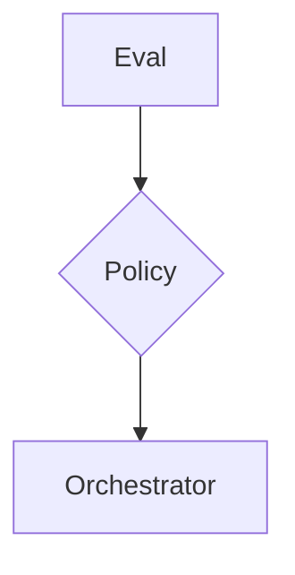

## Overview

Trust is paramount in an enterprise AI system. The MindLab platform includes a robust Evaluation Loop, a continuous process designed to ensure that the outputs of our specialist agents are not only accurate, but also consistently aligned with your business objectives and quality standards.

<Note>
We do not claim to train new base models. Instead, we focus on shaping the behavior of our runtime MoE system through a sophisticated system of measurement and feedback.
</Note>

## Design Rationale

The Evaluation Loop is designed to solve three key problems with traditional AI systems:

1.  **Lack of Quality Control:** It is difficult to ensure the quality of the outputs of a black-box AI system.
2.  **Lack of Alignment:** It is difficult to ensure that the outputs of an AI system are aligned with your business objectives.
3.  **Lack of Improvement:** It is difficult to improve the performance of an AI system over time.

The Evaluation Loop solves these problems by providing a continuous, data-driven process for measuring and improving the performance of our platform.

## Mechanism/Algorithm

The Evaluation Loop is a multi-faceted system that includes both automated and human-in-the-loop processes.

### Components of the Evaluation Loop

<AccordionGroup>
  <Accordion title="Goldens & Rubrics">
    We establish a set of "golden tasks," which are representative examples of the workflows you will be running on the platform. These tasks have a known, high-quality output, and they are run continuously to detect any regressions in performance before they can impact production. For more complex, subjective tasks, we use rubric scorers to evaluate the outputs against a predefined quality rubric.
  </Accordion>
  <Accordion title="Adversarial Review">
    We employ adversarial review, where a separate set of agents is tasked with finding flaws and edge cases in the outputs of the primary agents. This helps us to proactively identify and address potential weaknesses in the system.
  </Accordion>
  <Accordion title="Policy Shaping">
    The data generated by this evaluation process is fed back into the Orchestrator as a set of reward-style signals. These signals do not retrain the base models, but they do shape the routing and gating decisions of the Orchestrator over time, ensuring that the system continuously learns and adapts to deliver the highest-quality outcomes.
  </Accordion>
</AccordionGroup>

## Data/Interfaces

The Evaluation Loop exposes a simple, programmatic interface to the Orchestrator. The Orchestrator can use this interface to submit tasks for evaluation and to receive feedback on the performance of its agents.

## Failure Modes & Mitigations

-   **Evaluation Leakage:** There is a risk that our evaluation process could "leak" information to our agents, allowing them to "cheat" on our benchmarks. We mitigate this risk through a variety of techniques, including the use of a separate, held-out test set for our final evaluations.
-   **Metric Gaming:** There is a risk that our agents could learn to "game" our evaluation metrics. We mitigate this risk by using a diverse set of metrics and by continuously monitoring for signs of gaming.

## Example Walkthrough

A user submits a task to the Orchestrator. The Orchestrator routes the task to an agent, and the agent produces an output. The output is then submitted to the Evaluation Loop for review. The Evaluation Loop returns a score, and the Orchestrator uses this score to update its routing policies.

## Metrics & SLOs

-   **Evaluation Time:** < [METRIC_PLACEHOLDER] ms
-   **Evaluation Accuracy:** > [METRIC_PLACEHOLDER]%

## Key Takeaways

-   The Evaluation Loop is a continuous process for ensuring the quality and reliability of our AI agents.
-   It is designed to solve the problems of lack of quality control, lack of alignment, and lack of improvement that are inherent in traditional AI systems.
-   It is a multi-faceted system that includes both automated and human-in-the-loop processes.