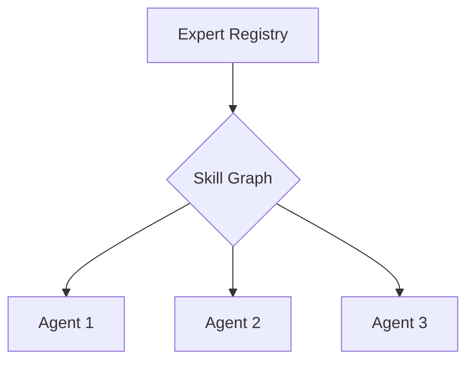

## Overview

The MindLab platform is not a single AI; it is a coordinated ecosystem of specialist agents. The Expert Registry is the component that manages this ecosystem, providing the Orchestrator with a queryable, runtime directory of available skills and capabilities.

## Design Rationale

The Expert Registry is designed to solve three key problems with traditional AI systems:

1.  **Lack of Specialization:** A single, general-purpose model is rarely the best tool for every task. The Expert Registry is designed to leverage the power of a diverse ecosystem of specialized agents.
2.  **Lack of Extensibility:** It is difficult to add new capabilities to a monolithic model. The Expert Registry allows for new capabilities to be added by simply registering a new expert.
3.  **Lack of Controllability:** It is difficult to control the behavior of a monolithic model. The Expert Registry provides a rich set of controls for managing the behavior of your AI systems.

## Mechanism/Algorithm

The Expert Registry is a directed skill graph of typed specialist agents.

### Typed Specialists

Each agent in the registry is a "typed specialist." This means that it is defined by a clear, machine-readable contract that specifies its capabilities, constraints, and operational parameters.

<AccordionGroup>
  <Accordion title="Capability Vectors">
    A detailed description of the agent's skills and the types of tasks it is qualified to perform.
  </Accordion>
  <Accordion title="Tool Affordances">
    The specific tools and APIs that the agent is authorized and able to use.
  </Accordion>
  <Accordion title="Safety Constraints">
    The operational guardrails and policies that the agent must adhere to.
  </Accordion>
  <Accordion title="Quotas & Backpressure">
    The rate limits and load-handling capabilities of the agent.
  </Accordion>
</AccordionGroup>

### The Directed Skill Graph

The Expert Registry is not a flat list; it is a directed skill graph. This means that the Orchestrator can reason about the relationships between different agents and their skills.

For example, the Orchestrator understands that a "Financial Analyst" agent might depend on a "Data Retrieval" agent. This allows it to construct complex, multi-agent workflows that are both efficient and robust.

### Eligibility Resolution

At runtime, the Orchestrator queries this graph to find the optimal agent for each sub-task. This eligibility resolution process includes both hard and soft filters.

<CardGroup cols={2}>
  <Card title="Hard Filters" icon="filter">
    -   **Policy:** Does the agent comply with all relevant organizational policies?
    -   **Data Boundaries:** Does the agent have access to the required data sources?
  </Card>
  <Card title="Soft Priors" icon="filter-list">
    -   **Historical Confidence:** How successful has the agent been at similar tasks in the past?
  </Card>
</CardGroup>

## Data/Interfaces

The Expert Registry exposes a simple, queryable interface to the Orchestrator. The Orchestrator can query the registry for agents with specific skills, and the registry will return a list of eligible agents.

## Failure Modes & Mitigations

-   **No Suitable Agent:** The Orchestrator may be unable to find a suitable agent for a particular task. In this case, it will escalate the task to a human for review.
-   **Agent Failure:** An agent may fail to complete a task. In this case, the Orchestrator will retry the task with a different agent.

## Example Walkthrough

A user wants to create a competitive analysis report. The Orchestrator queries the Expert Registry for agents with the "market-research" skill. The registry returns a list of eligible agents, and the Orchestrator selects the best one for the job.

## Metrics & SLOs

-   **Query Time:** < [METRIC_PLACEHOLDER] ms
-   **Agent Availability:** > [METRIC_PLACEHOLDER]%

## Key Takeaways

-   The Expert Registry is a directed skill graph of typed specialist agents.
-   It is designed to solve the problems of lack of specialization, lack of extensibility, and lack of controllability that are inherent in traditional AI systems.
-   It exposes a simple, queryable interface to the Orchestrator.
-   It includes a robust eligibility resolution process that includes both hard and soft filters.