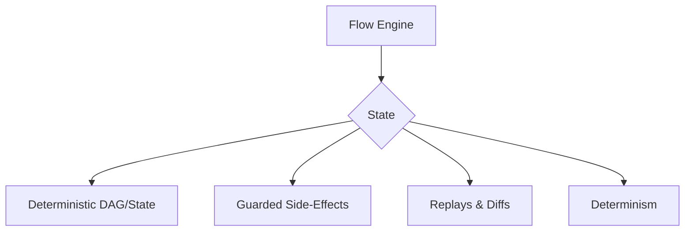

## Overview

Underpinning the Orchestrator and the Context Spine is the Flow Engine, the stateful execution layer that ensures every workflow is executed with precision, predictability, and resilience.

## Design Rationale

The Flow Engine is designed to provide enterprise-grade guarantees about the state of your AI-driven work. It is not a "best-effort" system; it is a deterministic engine that provides full control over side effects and enables powerful debugging and auditing capabilities.

## Mechanism/Algorithm

The Flow Engine is a deterministic, stateful execution layer that is designed to provide a high degree of control and visibility into the execution of your AI-driven workflows.

### Core Architectural Features

<CardGroup cols={2}>
  <Card title="Deterministic DAGs" icon="diagram-project">
    Every workflow is executed as a deterministic Directed Acyclic Graph (DAG) or state machine. This ensures that for a given input, the outcome will be the same every time.
  </Card>
  <Card title="Guarded Side Effects" icon="shield-halved">
    Any interaction with external systems is treated as a guarded side effect. The Flow Engine includes robust mechanisms for timeouts, retries, and error handling, ensuring that the system is resilient to external failures.
  </Card>
  <Card title="Time-Travel Debugging" icon="clock-rotate-left">
    The stateful nature of the Flow Engine allows for replays and diffs of workflow executions. This "time-travel debugging" is a powerful capability for understanding and resolving issues.
  </Card>
  <Card title="Determinism" icon="anchor">
    We provide the ability to use seeded decoding and policy snapshots to ensure reproducible runs, which is critical for debugging, auditing, and compliance.
  </Card>
</CardGroup>

## Data/Interfaces

The Flow Engine exposes a simple, programmatic interface to the Orchestrator. The Orchestrator can use this interface to create, execute, and monitor workflows.

## Failure Modes & Mitigations

-   **Workflow Failure:** A workflow may fail due to an error in an agent or an external system. In this case, the Flow Engine will automatically retry the workflow.
-   **State Corruption:** The state of a workflow may become corrupted. In this case, the Flow Engine will automatically roll back the workflow to a previous known-good state.

## Example Walkthrough

A user wants to create a competitive analysis report. The Orchestrator creates a workflow and submits it to the Flow Engine. The Flow Engine executes the workflow, and the Orchestrator monitors its progress.

## Metrics & SLOs

-   **Workflow Execution Time:** < [METRIC_PLACEHOLDER] s
-   **Workflow Success Rate:** > [METRIC_PLACEHOLDER]%

## Key Takeaways

-   The Flow Engine is the stateful execution layer of the MindLab platform.
-   It is designed to provide enterprise-grade guarantees about the state of your AI-driven work.
-   It is a deterministic, stateful execution layer that is designed to provide a high degree of control and visibility into the execution of your AI-driven workflows.