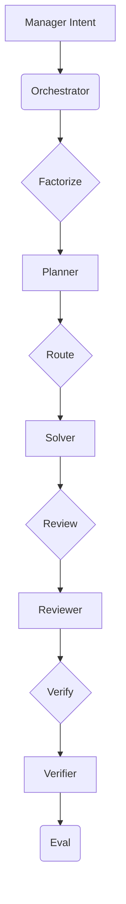

## Overview

The MindLab Orchestrator is a runtime Mixture-of-Experts (MoE) engine that intelligently coordinates the work of specialized agents to achieve complex business objectives. It is the core of the MindLab platform, and it is responsible for translating user intent into a series of auditable, deterministic actions.

## Design Rationale

The Orchestrator is designed to solve three key problems with traditional AI systems:

1.  **Monolithic Architecture:** Traditional AI systems are often built as monolithic, end-to-end models. This makes them difficult to debug, maintain, and extend.
2.  **Lack of Specialization:** A single, general-purpose model is rarely the best tool for every task. The Orchestrator is designed to leverage the power of a diverse ecosystem of specialized agents.
3.  **Lack of Controllability:** It is difficult to control the behavior of a monolithic model. The Orchestrator provides a rich set of controls for managing the behavior of your AI systems.

## Mechanism/Algorithm

The Orchestrator's primary function is to factorize user intent into a series of atomic, testable sub-tasks and then route those tasks to the most appropriate specialist agent.



### Task Factorization

The Orchestrator receives a high-level objective and breaks it down into a directed acyclic graph (DAG) or state machine of smaller, well-defined sub-tasks.

### Routing

For each sub-task, the Orchestrator queries the Expert Registry to find the optimal agent. This decision is based on a combination of factors:

<AccordionGroup>
  <Accordion title="Skill Tags">
    Does the agent have the required skills?
  </Accordion>
  <Accordion title="Calibrated Uncertainty">
    How confident is the agent in its ability to complete the task?
  </Accordion>
  <Accordion title="Cost Envelopes">
    Can the agent meet the performance and budget constraints defined in the CADANCE™ Spec?
  </Accordion>
  <Accordion title="Policy Gates">
    Does the proposed action comply with all relevant organizational policies?
  </Accordion>
</AccordionGroup>

### Topologies

The Orchestrator can dynamically select the optimal topology for your specific request. A common and powerful topology for this process is a **Planner → Solver → Reviewer → Verifier** chain, where each step has the ability to veto the process or cascade it to an alternative agent, ensuring a high degree of quality and control.

### Late Binding

The Orchestrator supports the late binding of experts and tools. This means that it can make decisions about which agent or tool to use at the last possible moment, based on the most up-to-date signals from the environment.

## Data/Interfaces

The Orchestrator exposes a simple, natural-language interface to the user. The user states their objective, and the Orchestrator handles the rest.

## Failure Modes & Mitigations

-   **Routing Failure:** The Orchestrator may be unable to find a suitable agent for a particular task. In this case, it will escalate the task to a human for review.
-   **Execution Failure:** An agent may fail to complete a task. In this case, the Orchestrator will retry the task with a different agent.
-   **Policy Violation:** An agent may attempt to perform an action that violates a policy. In this case, the Orchestrator will block the action and escalate the task to a human for review.

## Example Walkthrough

A user wants to create a competitive analysis report. They state their objective to the Orchestrator in natural language. The Orchestrator factorizes this request into a series of sub-tasks and then routes those tasks to the appropriate agents.

```yaml
Agents:
  - role: "MarketResearcher"
  - role: "DataRetriever"
  - role: "StrategicAnalyst"
  - role: "ReportGenerator"
```

## Metrics & SLOs

-   **Routing Time:** < [METRIC_PLACEHOLDER] ms
-   **Task Success Rate:** > [METRIC_PLACEHOLDER]%

## Key Takeaways

-   The MindLab Orchestrator is a runtime Mixture-of-Experts (MoE) engine.
-   It is designed to solve the problems of monolithic architecture, lack of specialization, and lack of controllability that are inherent in traditional AI systems.
-   It factorizes user intent into a series of atomic, testable sub-tasks and then routes those tasks to the most appropriate specialist agent.
-   It supports a variety of powerful topologies, including the Planner → Solver → Reviewer → Verifier chain.
-   It supports the late binding of experts and tools.